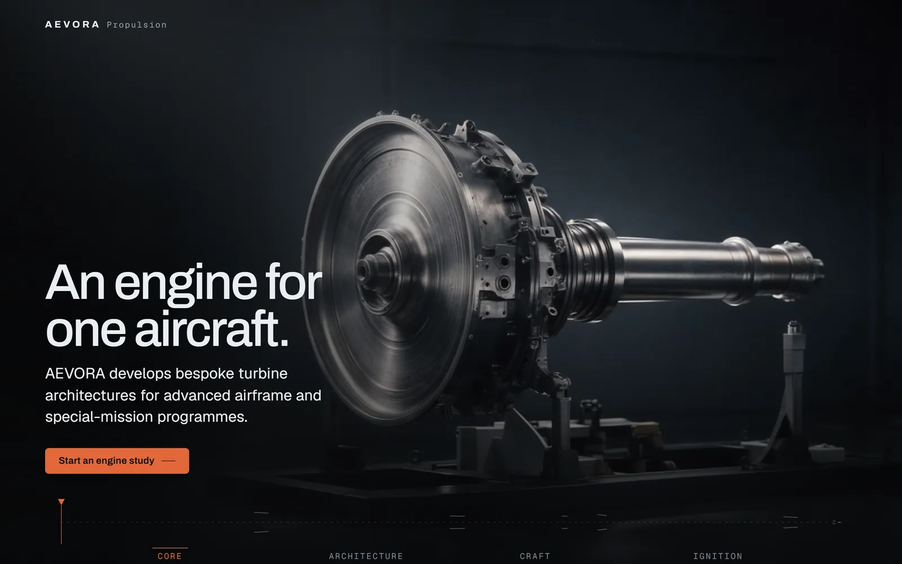
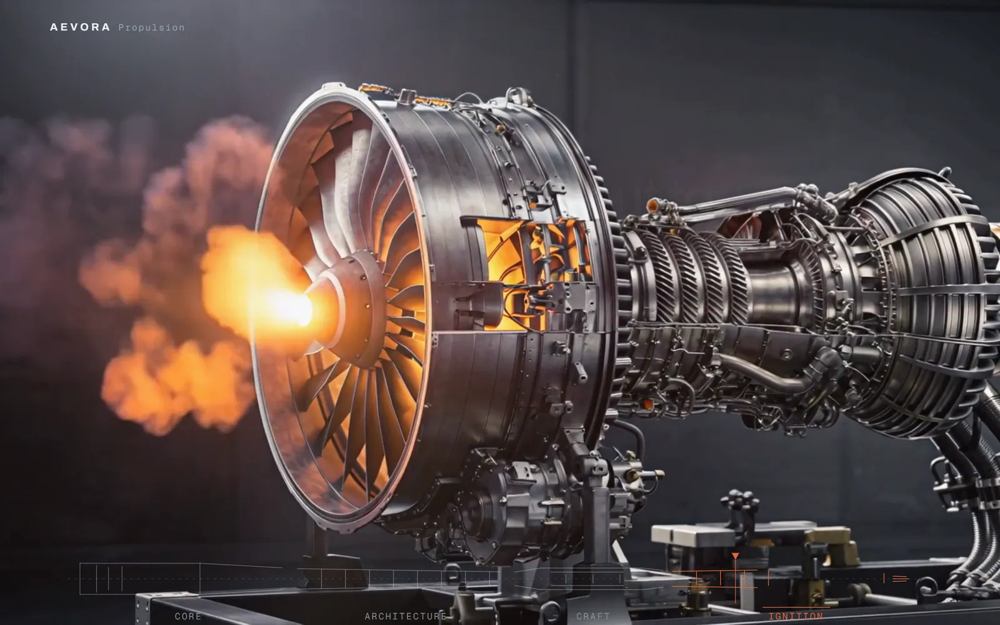
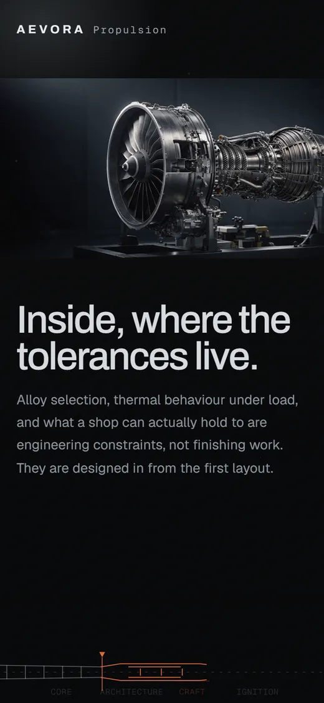
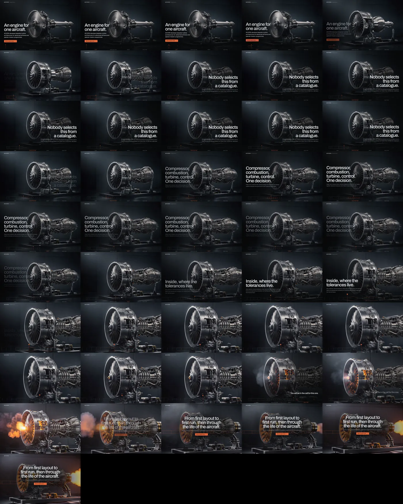
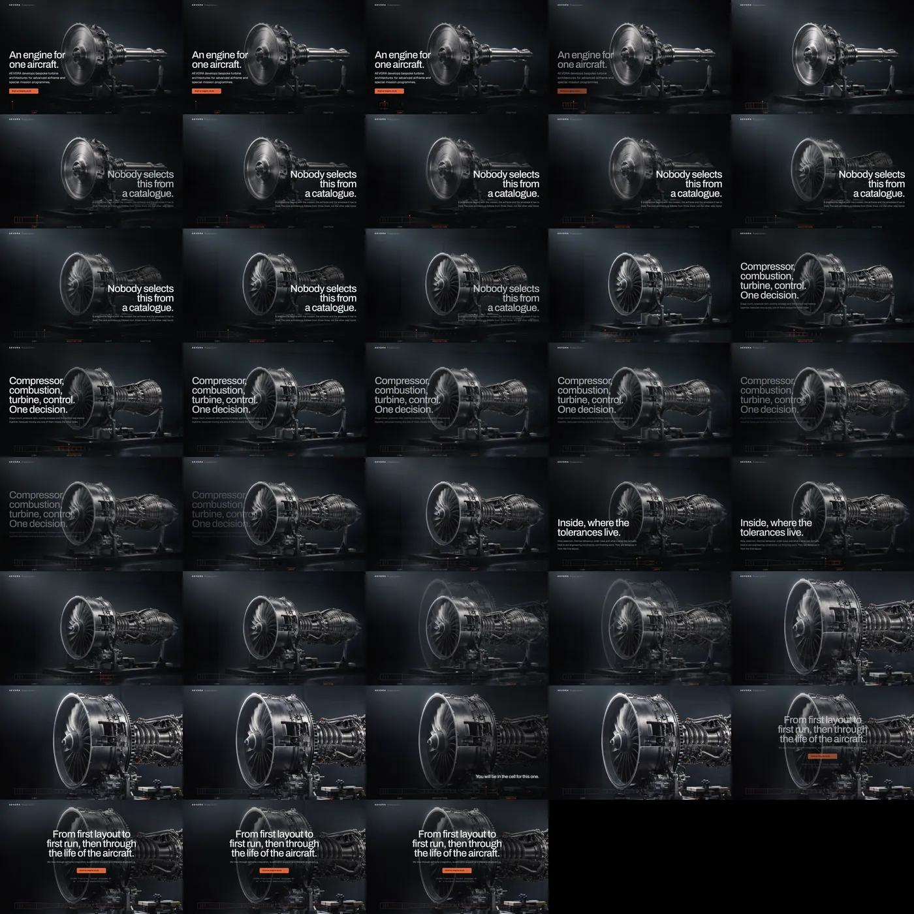
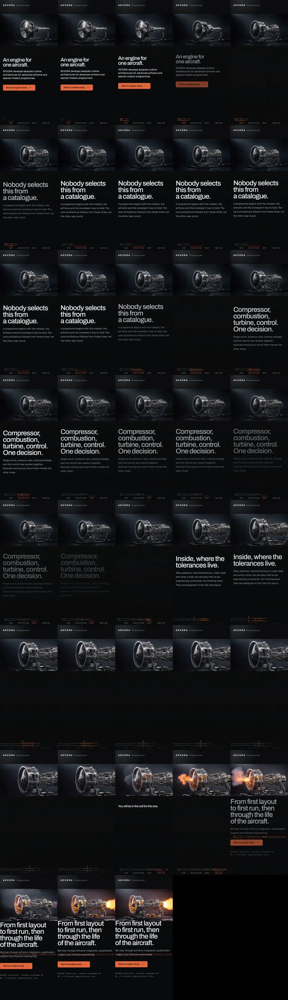
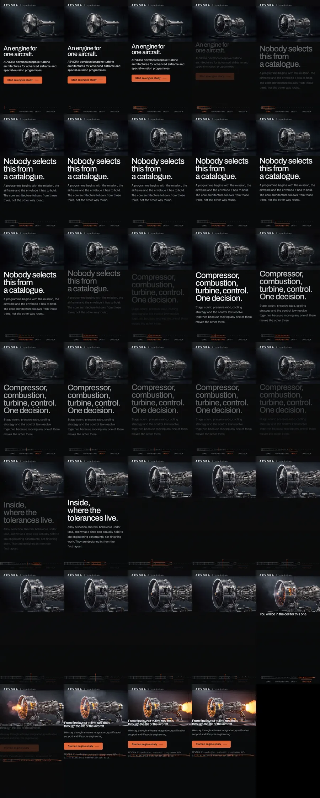
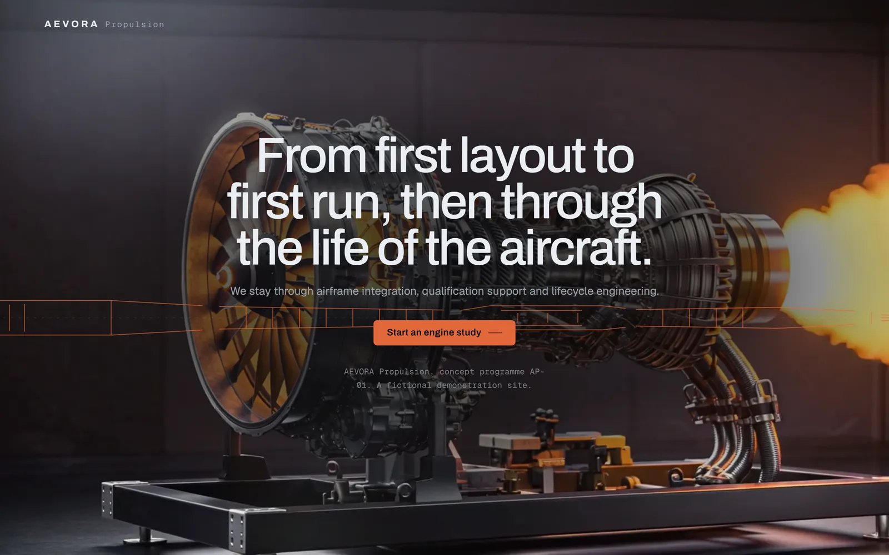

# AEVORA Propulsion

**A jet engine assembles under your hand, then ignites.**

A scroll-driven concept site for a bespoke turbine-engine manufacturer. The whole
page is one continuous camera move through one test cell: you scroll, an engine
builds itself from a bare shaft, the camera goes inside it, and then it lights.

**→ [See it running](https://lumsrouge.github.io/aevora-propulsion/)**

> **AEVORA is not a real company.** It does not exist, it has never certified an
> engine, and `projects@aevora.example` will not reply to you. This is a
> portfolio build. Every number you *don't* see on the page is missing on
> purpose: no fake thrust ratings, no invented reliability percentages, no
> "trusted by 400+ airframers." Inventing statistics for an aerospace supplier
> seemed like a fast route to a conversation with someone's legal department.



---

## What it actually is

Scroll is the only input every visitor already knows how to use. This page
treats it as a timeline: the wheel is a scrubber and the page is a film with
real, selectable, translatable HTML on top of it.

There are no sections. There is one `position: fixed` stage, four video legs all
mounted at once, one fixed copy layer, and a single empty spacer that provides
the scroll track. Nothing pins, nothing unpins, nothing slides past anything.
This is scroll-craft's **worldflight** mode, and it exists because the obvious
way to build this — a stack of pinned sections — produces a page with visible
horizontal seams travelling up the screen, which reads as exactly what it is.

### The four legs

| Leg | Scroll | What happens | What you should feel |
|-----|-------:|--------------|----------------------|
| Core | 2.34vh | A bare shaft and fan hub become a compressor core | Curiosity |
| Architecture | 2.34vh | The core gains a combustor, casing, accessories | Fascination |
| Craft | 2.34vh | The camera travels *inside* and comes to rest | Intimacy, then held breath |
| **Ignition** | **4.68vh** | The rotor spools, the machine lights, the camera withdraws, the plume holds | Power, then resolve |

Ignition gets exactly twice the scroll of anything else. That is not an accident
and it is not padding: people remember one peak and the ending, so one act gets
the asset budget, the silence in front of it, and the room to land. Everything
else is deliberately quieter so that it can be.

Every leg runs at **0.46 viewport-heights per second of film**, held to a 0.6%
spread. A camera that changes speed between legs doesn't read as expressive, it
reads as broken.

### The silence

Between track fractions **0.545 and 0.655** — about 1.3 viewport-heights — there
is no copy on screen at all. The camera has stopped inside the engine and
nothing is being said. This is authored, it is written into `BRIEF.md`, and the
verification harness is told about it, because an empty screen you meant reads
as anticipation and an empty screen you didn't reads as a page that failed to
load.

---

## The signature move: the axial cutaway rail



Fixed to the bottom edge is a longitudinal technical section of the engine. It
does four jobs at once:

1. **It assembles itself.** Each stage draws its own strokes via
   `stroke-dashoffset` as you scroll through the matching leg, and completed
   stages stay drawn. By ignition you are holding a finished section rather than
   arriving at a footer.
2. **It is the navigation.** Four labelled, keyboard-focusable `<button>` stops
   that jump to their leg. There is no nav bar anywhere on this site.
3. **It follows the camera.** On the Craft leg it eases its own `viewBox` into
   the combustor, so the schematic goes where the lens goes.
4. **It closes around the action.** At the finale it lifts off the bottom edge
   and settles on the CTA, in accent, so the commission button ends up sitting
   on the engine's own axis.

All of it is page-local JavaScript reading `--sc-seg`, `--sc-segp` and the
`sc:waypoint` event. The scroll-craft engine files in this repo are **byte-identical
to the ones the skill ships** — verified by checksum, not by vibes.

---

## Mobile is a different composition, not a smaller one



A 16:9 frame cover-cropped into a 390×844 viewport shows about a quarter of its
width. The first phone build did exactly that, and the result was a beautiful,
extremely expensive close-up of some metal. You could not tell it was an engine,
which is unfortunate for a website whose entire argument is "look at this
engine."

So phones get a different layout: the film is a whole, full-width band in the
upper screen and the copy holds the lower screen on the page ground, with the
section rail beneath it. Verified at 390×844 and at a cramped 360×640.

---

## Verification

A scroll page has no single state. Every scroll position is a different frame,
and the bugs live between the two you happened to look at. So it gets walked
programmatically at 8 positions per leg, four times over.

| Run | Result |
|-----|--------|
| Desktop 1440×900 | No dead scroll · all 4 legs reach full opacity and paint real frames · all copy ≥4.5:1 at its worst frame |
| Phone 390×844 | Same, on the recomposed phone layout |
| Compact 360×640 | Same |
| Reduced motion | No clip is ever fetched, posters carry the whole story, every transform dropped |
| `lab/aev-assert.mjs` | **19/19** — playhead lerp convergence and non-overshoot, one-sided seam crossfades, the 4vh copy-transform cap, rail accumulation, reduced-motion contract |

Contact sheets, at a size a human can look at:

| Desktop | Reduced motion |
|---|---|
|  |  |

| Phone 390×844 | Compact 360×640 |
|---|---|
|  |  |

Things the harness caught that a human eye had already signed off on:

- The hero headline ran to four lines straight across a polished fan disc, at
  **1.61:1**. It looked fine. It was not fine.
- The finale scrim buried the exhaust plume — the single frame the entire page
  was built to arrive at — in near-black.
- The close CTA was a tab stop while sitting at `opacity: 0`, so a keyboard user
  could focus a button nobody could see.

**Not verified: a real phone.** Headless Chrome cannot reproduce iOS video
decoding, autoplay policy, or Low Power Mode. If it stutters on your iPhone,
that is a genuinely untested surface and not me being coy about it.

---

## Known flaw, stated plainly



For roughly the middle third of the ignition clip, **flame comes out of the
intake.**

On a real turbofan, air goes *in* at the front. Fire coming back out of it is
called a compressor stall or a hot start, and it is the single least reassuring
thing an engine can do in front of a customer. It is a spectacular failure mode
being presented here as a successful first run.

One reroll was spent trying to fix it. The reroll came back with the camera
pushing *in* instead of withdrawing, the test cell having spontaneously grown
LED strip lighting, and the intake flame worse. The first take was kept. Both
takes are in `out/` if you want to judge for yourself.

This is the honest boundary of the tool: an image-to-video model can be held to
a start frame and a camera move. It cannot be held to a causal model of airflow.

---

## Running it locally

```bash
npm install
npm run serve          # http://localhost:4512

# and, if you want the assertions:
npm run assert
```

No build step, no bundler, no framework. It is an `.html` file, two stylesheets,
two scripts and some video.

```
index.html          real <h1>, real <p>, real reading order
aevora.css          six colour tokens, two typefaces, the rail, the scrims
aevora.js           the rail, the atmosphere planes, the windowed scrims
scrollcraft.js/css  the engine, unmodified
assets/             4 legs × desktop + mobile encodes, dense GOP for scrubbing
out/                raw generation masters, including the rejected takes
lab/                assertions and verification contact sheets
BRIEF.md            the brief, the feeling curve, the peak, the score
```

Clips are encoded at GOP 8 (desktop) and GOP 4 (mobile). A normal web encode
places a keyframe every two to five seconds, plays back perfectly, and scrubs
like mud, because seeking makes the decoder walk forward from the previous
keyframe. Dense keyframes cost file size and buy responsiveness. That trade is
the whole reason these files look oversized.

---

## Stack

- **[scroll-craft](https://github.com/nateherk)** — worldflight mode, the scroll engine
- **kie.ai** — Seedream 5 Pro for the anchor stills, Kling v2.1 Pro for the camera moves
- **ffmpeg** — scrub-optimised encoding, poster extraction, seam PSNR
- **Playwright** — the verification harness
- **Archivo / Geist / Geist Mono** — display, text, labels

Total generation spend: **456 credits** across 4 stills and 6 clip jobs, one of
which timed out upstream and one of which was rejected on sight.

Built with [Claude Code](https://claude.com/claude-code).

---

## Licence

Code is MIT. The generated imagery is a fictional engine for a fictional company
and is provided for portfolio and reference purposes.
